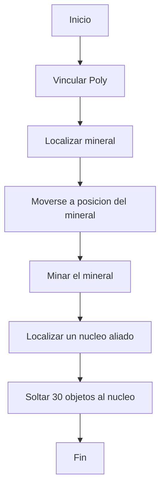
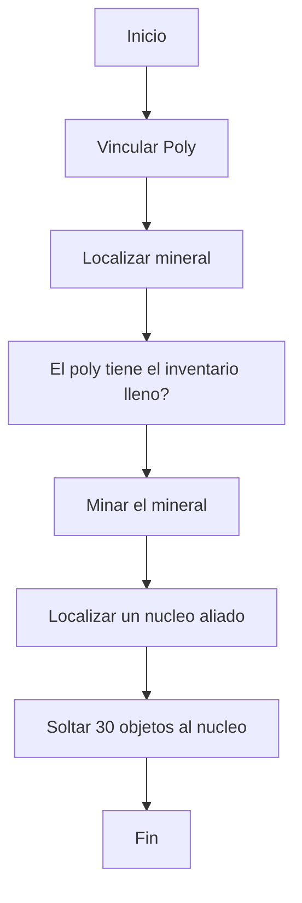

# Flujo de ejecución, concepto e instrucciones

## Concepto

El flujo de ejecución es el orden en el que las instrucciones se ejecutarán dentro de un procesador, este puede modificarse para alterar que instrucciones se ejecutarán en un caso específico y cuales no. Este cuenta con una serie de características:

* Normalmente se ejecuta de arriba hacia abajo.
* Cuando se ha ejecutado la última instrucción del procesador, el flujo se reiniciará, ejecutando todo desde la primera instrucción. Creando un comportamiento de bucle.
* Todo lo realizado en los bucles de ejecución del procesador (declarar variables, asignar valores, etc.) es mantenido, no se elimina.

![[control-flujo-funcionamiento.gif]]

Nota:  El código mostrado en este y los siguientes flujos no funcionan y solo se usan para mostrar distintas instrucciones, pareciera funcionar pero recordemos que los procesadores hacen exactamente lo que les decimos y no tienen ambigüedades.

## Instrucciones

Existen diversas instrucciones que permitirán modificar el flujo de ejecución de un procesador, estas se encuentran dentro de su propia categoría, `Control de flujo` con un color cían:

![[control-flujo-instrucciones.png]]
### wait

Detiene la ejecución del procesador una cierta cantidad de segundos.

![[control-flujo-wait.gif]]
### stop

Detendrá completamente la ejecución de instrucciones en el procesador dejándolo inactivo permanentemente.

![[control-flujo-stop.gif]]
### end

Reiniciará el flujo de ejecución, regresando a la primera instrucción, es equivalente a haber llegado a la última instrucción.

![[control-flujo-end.gif]]

### jump

La piedra angular del sistema lógico, los saltos permiten crear comportamientos diversos en base a toma de decisiones, cosa que no sería posible sin ellos. Estos cuentan con una condición, que, cuando se cumple, saltará a una instrucción específica, ignorando las que le seguían debajo de la misma, cuenta con las siguientes comparativas:

* `Igualdad == `: Compara 2 objetos, números, unidades o tipo de dato. Resultando verdadero si son iguales. Convertirá el tipo de dato de los mismos si es necesario.
* `Negación not `: Invertirá el resultado de una igualdad realizada con los objetos, números, unidades o tipo de dato comparados. Convertirá el tipo de dato de los mismos si es necesario.
* `Menor que < `: Compara 2 objetos, números, etc. Resulta verdadero si el primero es menor que el segundo.
* `Menor o igual que <=` Compara 2 objetos, números, etc. Resulta verdadero si el primero es menor o igual que el segundo.
* `Mayor que >` Compara 2 objetos, números, etc. Resulta verdadero si el primero es mayor que el segundo.
* `Mayor o igual que >=` Compara 2 objetos, números, etc. Resulta verdadero si el primero es mayor o igual que el segundo.
* `Igualdad estricta === ` Equivalente a la igualdad, solo que no convertirá el tipo de dato de lo que se encuentre comparando.
* `Siempre always` Es una condición que siempre será cierta, resultando en que siempre se salte.

## Estructuras en bucle o cíclicas

El comportamiento de la instrucción jump nos permite crear estructuras que en programación se conoce como cíclicas, donde una sección de código se repite tantas veces sea necesario ya sea usando un valor que se incrementa cada que se ejecuta una iteración del bucle o hasta que una condición se cumpla.

En el código anterior se crea un ciclo que repite una sección de código hasta que un valor incrementado alcanza cierta cantidad, al terminar el bucle y como no existen instrucciones posteriores se regresa a la primera instrucción, reiniciando la iteración y volviendo a establecer parámetros.

## Creación de un flujo de ejecución variable 

Ahora que conocemos como el flujo de ejecución se ejecuta normalmente, las distintas instrucciones que existen para modificarlo y las estructuras que podemos hacer, podemos construir comportamientos avanzados como el que se veía en ejemplos anteriores como minar y depositar al núcleo.

## Manipulación avanzada del flujo de ejecución

Esta técnica se desarrolló en base a la variable `counter` que existe en cada procesador, esta variable indica cual será el índice de la próxima instrucción a ejecutarse, y al ser una variable, puede ser modificada, por lo que por ejemplo puedes simular el funcionamiento de una instrucción `jump`, o creación de estructuras como funciones. (No conozco mucho de esto)

